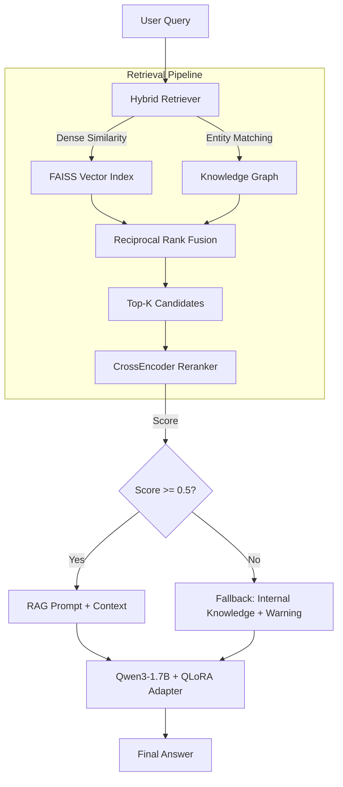

# KG-Augmented QLoRA Fine-Tuning for Domain-Specific RAG

**Fine-tuning Qwen3-1.7B with QLoRA and Knowledge-Graph-Enhanced Retrieval on Italian Public Administration Documents**

This project explores the adaptation of Small Language Models (SLMs) to highly specialized, non-English domains (Italian public procurement law) using a combination of Parameter-Efficient Fine-Tuning (QLoRA) and Advanced Retrieval-Augmented Generation (Hybrid Dense + KG Retrieval).

---

## 🏛️ Architecture



### Key Features
1. **Hybrid Retrieval**: Combines semantic FAISS search with domain-specific Knowledge Graph entity traversal, merged via Reciprocal Rank Fusion (RRF).
2. **CrossEncoder Reranking**: Re-evaluates chunk relevance to the query, filtering out weak context.
3. **Adaptive Fallback**: Uses empirical thresholding (`rerank_score < 0.5`) to detect out-of-domain/unanswerable queries and seamlessly falls back to the model's internal knowledge (with a transparent user warning) rather than hallucinating based on irrelevant documents.
4. **QLoRA Fine-tuning**: 4-bit quantized Low-Rank Adaptation of Qwen3-1.7B using a synthetically generated QA dataset derived directly from the corpus.

---

## 📊 Experimental Results & Key Findings

### 🧠 Training Phase Details
- **Final Training Run**: **3 Epochs**. Convergence analysis showed that training loss dropped smoothly by about 40%, but after step 40, the validation loss plateaued. This proved that 2–3 epochs is the sweet spot to learn the Italian legal domain without memorizing the training data.
- **Best Hyperparameters**: LoRA Rank `r=8` (or 16), Learning Rate `2e-4` with Cosine decay. The grid search proved learning rate was the dominant performance factor.

### 💾 Data & Efficiency
- **Dataset Size**: The model was trained on 473 instruction-tuned (SFT) samples derived from the PDFs, with 59 validation samples to monitor overfitting.
- **Parameter Efficiency**: By freezing the base model and using QLoRA in 4-bit NF4 precision, only **0.5% – 0.85%** of the 1.7B parameters were actively trained, making the fine-tuning process extremely parameter-efficient.

### 🖥️ Hardware & Setup
- **GPU Profile**: The entire pipeline fits and trains efficiently on a single Kaggle **Nvidia Tesla T4 (15.6 GB VRAM)**.
- **Quantization**: The base model (Qwen3-1.7B) was loaded in 4-bit precision (`bitsandbytes`) to drastically reduce VRAM usage, allowing the context window to fit within the memory limits of the free GPU tier.

### 🧪 Ablation Study
Our 2×2 factorial ablation study on a held-out test set evaluated the independent effects of fine-tuning and retrieval strategy:

| Effect | ROUGE-L | BERTScore | Context Recall | Faithfulness |
|---|---|---|---|---|
| **Base + Dense** | 0.129 | 0.564 | 0.425 | 0.295 |
| **Base + Hybrid** | 0.111 | 0.551 | 0.418 | 0.256 |
| **QLoRA + Dense** | **0.161** | 0.654 | **0.425** | **0.418** |
| **QLoRA + Hybrid** | 0.149 | **0.658** | 0.418 | 0.389 |

- **Fine-Tuning Impact**: QLoRA is the primary driver of performance. It drove a **+24.8\%** increase in ROUGE-L, a **+15.9\%** increase in BERTScore, and a massive **+41.7\%** increase in Faithfulness over the baseline. The model successfully learned to synthesize answers in formal Italian rather than copying text verbatim.
- **Retrieval Impact**: Surprisingly, the Hybrid (KG) retrieval slightly underperformed the pure Dense retrieval (Context Recall dropped from 0.425 to 0.418). This negative finding suggests that the extracted Knowledge Graph may be too sparse, causing Reciprocal Rank Fusion to occasionally down-rank highly relevant semantic chunks in favor of noisy graph matches.

---

## 🚀 How to Run the Kaggle Notebook

The full machine learning pipeline (Preprocessing, KG Construction, EDA, HP Tuning, Training, and Evaluation) is designed to run efficiently on Kaggle's free GPU tier.

1. **Environment Setup**:
   - Create a new Kaggle notebook or import `notebooks/slm-finetuning-rag-pa.ipynb`.
   - In the right-hand panel, go to **Settings → Accelerator** and select **GPU T4 x2**.
2. **Dataset Attachment**:
   - Click **Add Input** and attach the `empulia-regulations` dataset containing the 16 Italian PA PDFs.
   - *(Optional)* Attach previous cached artifacts (`artifact`, `evaluation`, `qlora-adapter`) to skip preprocessing or training steps and jump straight to analysis.
3. **Execution**:
   - Run the notebook top-to-bottom.
   - The notebook is highly modular; `SKIP_PREPROCESSING` and `SKIP_TRAINING` flags will automatically engage if cached datasets are detected.
   - Ensure the updated `matplotlib` lines (e.g. `%matplotlib inline`) are present so the ablation and EDA plots render directly in your browser.

---

## 💻 How to Test the Local App

The project includes an interactive web interface built with **Streamlit** (`app.py`). The application runs the full RAG pipeline and **loads the SLM model locally using your machine's NVIDIA GPU** (accelerated via Windows DirectML/CUDA) to ensure fast, private, and efficient inference.

### Prerequisites
- Python 3.12+
- Node package manager (optional, for UI styling if expanded)

### 1. Installation
We recommend using [`uv`](https://github.com/astral-sh/uv) for lightning-fast dependency management, but standard `pip` works too.

```bash
# Clone the repository
git clone https://github.com/yourusername/SLM_Finetuning_4_RAG.git
cd SLM_Finetuning_4_RAG

# Create and activate virtual environment
python -m venv .venv_gpu
.venv_gpu\Scripts\activate

# Install requirements (DirectML GPU support included)
pip install -r requirements.txt
```

### 2. Download Kaggle Artifacts
To run the app locally without retraining the model, you must download the artifacts generated by the Kaggle notebook and place them in your local `outputs/` folder:
- `outputs/qlora_adapter/` (The PEFT weights)
- `outputs/faiss_index.bin`
- `outputs/chunks.json`
- `outputs/knowledge_graph.json`

### 3. Launch the Application
Start the Streamlit interface:

```bash
streamlit run app.py
```

### 4. Interactive Testing
- Open the provided `localhost` URL in your browser.
- **In-Domain Query Test**: Ask *"Quali sono le regole per il subappalto?"* 
  - The app should retrieve the relevant documents (D.Lgs. 163/2006, Art. 118), score highly on the CrossEncoder, and provide a grounded legal answer.
- **Out-of-Domain Query Test**: Ask *"Quali sono i requisiti per l'accesso ai fondi europei?"* 
  - The CrossEncoder will score the retrieved context poorly (< 0.5).
  - The app will seamlessly trigger the **Knowledge-based Fallback**, displaying a ⚠️ warning icon, and generate an answer using its internal parameterized knowledge without hallucinating non-existent legal text.

---

## 📁 Project Structure

```text
├── app.py                        # Streamlit UI and Generation orchestration
├── notebooks/
│   ├── slm-finetuning-rag-pa.ipynb  # Main Kaggle training/evaluation pipeline
│   └── ml_classical/
│       └── 03_ensemble_methods.ipynb # Analysis of thresholding & reranking
├── src/
│   ├── rag/
│   │   ├── retriever.py          # Hybrid FAISS+KG Retrieval & CrossEncoder
│   │   └── generator.py          # Generation config
│   └── ...
└── README.md
```

## 📜 License
MIT License
